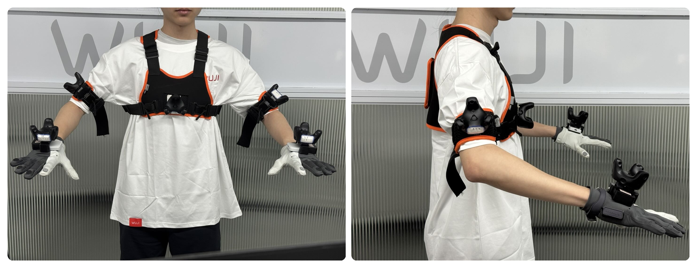
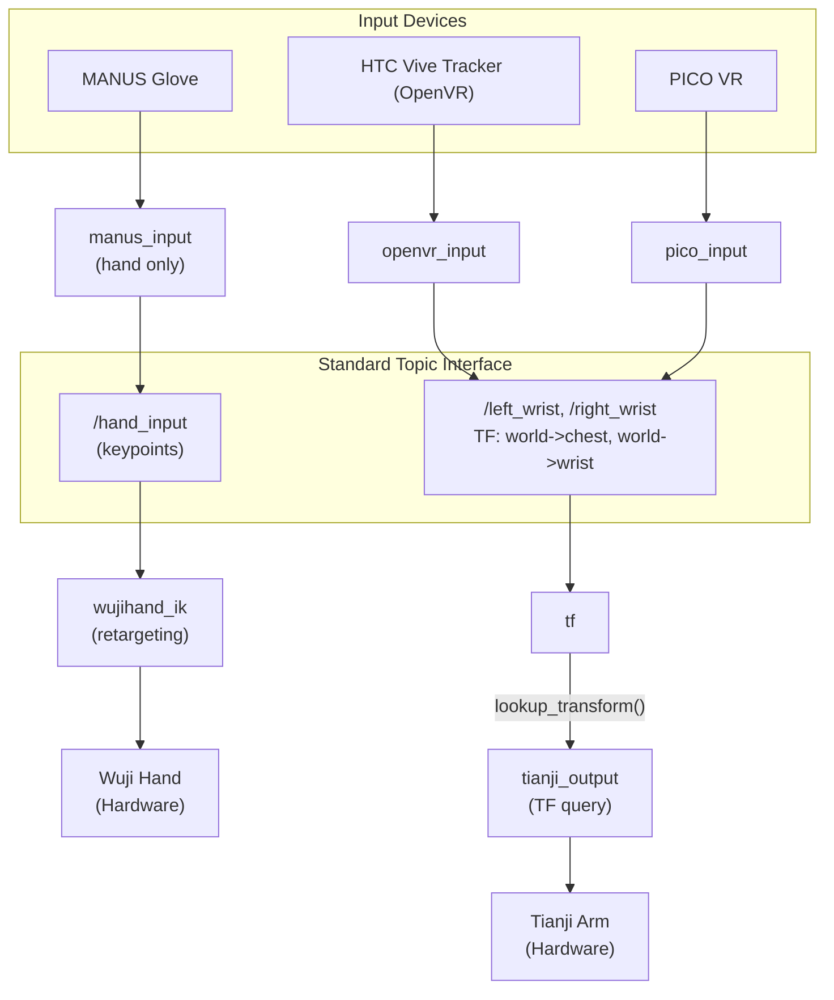

# wuji-hand-teleop

[](LICENSE)  [](https://github.com/wuji-technology/wuji-hand-teleop/releases)

ROS2-based teleoperation system for Wuji Hand and Tianji Arm. Supports multiple input devices including MANUS Gloves, HTC Vive Trackers, PICO VR, and custom devices through a standardized topic interface. Features a Monitor GUI for one-click launch and real-time device monitoring.

[](docs/teleop-demo.mp4)

Click the image above to download the demo video.

> [!WARNING]
> This project is **not actively maintained** and **no after-sales support** is provided. If you encounter any issues, please [open an issue](https://github.com/wuji-technology/wuji-hand-teleop/issues) — but responses are not guaranteed. **Product version coming soon.**

## Table of Contents

- [Repository Structure](#repository-structure)
- [Usage](#usage)
  - [Prerequisites](#prerequisites)
  - [Installation](#installation)
  - [Running](#running)
  - [System Architecture](#system-architecture)
  - [Output](#output)
- [Troubleshooting](#troubleshooting)
- [Citation](#citation)
- [Appendix](#appendix)
  - [Node Reference](#node-reference)
  - [Topic Interface](#topic-interface)
  - [Custom Input Device](#custom-input-device)
  - [Configuration Files Summary](#configuration-files-summary)
  - [Hardware BOM](#hardware-bom)
  - [Documentation Index](#documentation-index)
  - [Acknowledgements](#acknowledgements)
- [Contact](#contact)

## Repository Structure

```text
wuji-hand-teleop/
├── src/
│   ├── wuji_teleop_bringup/       # Launch files for various teleoperation modes
│   │   └── launch/
│   ├── wuji_teleop_monitor/       # Monitor GUI for device monitoring and one-click launch
│   ├── controller/                # Controller nodes for Wuji Hand and Tianji Arm
│   ├── input_devices/             # Input device packages
│   │   ├── common_input/          #   Shared input utilities
│   │   ├── openvr_input/          #   HTC Vive Tracker
│   │   ├── manus_input/           #   MANUS Glove
│   │   └── pico_input/            #   PICO VR
│   ├── output_devices/            # Output device packages
│   │   ├── tianji_output/         #   Tianji Arm controller (SteamVR)
│   │   ├── tianji_world_output/   #   Tianji Arm controller (PICO / world frame)
│   │   └── wujihand_output/       #   Wuji Hand controller with IK
│   ├── camera/                    # Camera system (RealSense, USB, StereoVR)
│   ├── wujihandros2/              # Wuji Hand ROS2 driver (submodule)
│   └── wujihand_urdf/             # URDF models for RViz visualization
├── docker/                        # Docker deployment files
├── docs/                          # Guides, images, and demo videos
├── CHANGELOG.md
└── README.md
```

## Usage

<details>
<summary>⚡ Quick Start — MANUS Glove + Wuji Hand (copy-paste one-liner)</summary>

The fastest path from zero to a running hand teleoperation — MANUS Glove controlling Wuji Hand. For arm control, cameras, and tracker setup, follow the structured guide below.

```bash
# 1. Clone
mkdir -p ~/ros2_ws/src && cd ~/ros2_ws/src
git clone --recurse-submodules https://github.com/wuji-technology/wuji-hand-teleop.git
cd wuji-hand-teleop
git lfs install && git lfs pull

# 2. Install dependencies
sudo apt install ros-humble-desktop ros-humble-ament-cmake ros-humble-rclpy ros-humble-std-msgs ros-humble-tf2-ros libncurses-dev python3-pip
python3 -m pip install numpy scipy pyyaml PyQt5 openvr
wget https://github.com/wuji-technology/wujihandpy/releases/download/v1.5.1/wujihandcpp-1.5.1-amd64.deb
sudo apt install ./wujihandcpp-1.5.1-amd64.deb
cd ~/ros2_ws/src
git clone --recurse-submodules https://github.com/wuji-technology/wuji-retargeting.git
cd wuji-retargeting && python3 -m pip install .
touch COLCON_IGNORE    # Prevent "Duplicate package names" with wujihandros2
cd ~/ros2_ws/src/wuji-hand-teleop
sudo cp src/input_devices/manus_input/config/udev/99-manus-libusb.rules /etc/udev/rules.d/
sudo udevadm control --reload-rules && sudo udevadm trigger

# 3. Configure Wuji Hand serial numbers
#    Find your serials:
#      lsusb -v -d 0483:2000 | grep iSerial
#    Then edit:
#      ~/ros2_ws/src/wuji-hand-teleop/src/output_devices/wujihand_output/config/wujihand_ik.yaml
#      left_hand:  serial_number: "YOUR_LEFT_HAND_SERIAL"   (or null to disable)
#      right_hand: serial_number: "YOUR_RIGHT_HAND_SERIAL"  (or null to disable)

# 4. Build
cd ~/ros2_ws
colcon build --symlink-install
source install/setup.bash
# Expected: "Summary: 18 packages finished [xx.xs]" with 0 failed

# 5. Launch
ros2 launch wuji_teleop_bringup wuji_teleop_hand.launch.py hand_input:=manus
# Expected: "Calibration loaded successfully for Left/Right glove"
#           "Publishing hand data on '/hand_input' at 120.0 Hz"
# Verify:   ros2 topic hz /hand_input  (should show ~120 Hz)
```

> **Using Docker?** See the [Docker Setup Guide](docker/README.md) — no manual dependency installation required.

</details>

### Prerequisites

- Ubuntu 22.04 LTS
- ROS2 Humble
- Python 3.10+

**Supported devices:**

| Category | Device | Description |
|----------|--------|-------------|
| Hand input | MANUS Glove | Data glove |
| Hand input | Wuji Glove | Data glove (coming soon) |
| Hand input | Custom device | Publish to `/hand_input` topic |
| Arm input | HTC Vive Tracker | External tracker |
| Arm input | PICO 4 + Tracker | VR headset + wrist/arm tracking |
| Arm input | Custom device | Publish TF to `left_wrist`/`right_wrist` (SteamVR mode), or `PoseStamped` to `/left_arm_target_pose`/`right_arm_target_pose` (PICO mode, see [Custom Input Device](#custom-input-device)) |

### Installation

#### Software

##### Step 1: Clone the Repository

```bash
mkdir -p ~/ros2_ws/src
cd ~/ros2_ws/src
git clone --recurse-submodules https://github.com/wuji-technology/wuji-hand-teleop.git
cd wuji-hand-teleop
```

> **Important**: `--recurse-submodules` is required. The repo contains submodules (wujihandros2, URDF models, etc.) that must be initialized.

Pull large files (MANUS SDK binaries, ~250 MB). This step is **required** — without it, the `.so` files are LFS placeholders and `manus_ros2` will fail to link:

```bash
git lfs install
git lfs pull
```

> **Note**: `git clone` does not automatically pull LFS files unless you have configured `git lfs install` globally before cloning. Always run `git lfs pull` after cloning to be safe.

**If you already cloned without `--recurse-submodules`:**

```bash
git submodule update --init --recursive
```

**If `git lfs pull` was skipped**, the MANUS SDK `.so` files will be placeholder text files and `manus_ros2` will fail to link. Run `git lfs pull` to fix.

**Verify**: `ls src/wujihandros2/` should show files (not empty). If empty, submodules were not initialized.

##### Step 2: Install Dependencies

###### ROS2 packages

```bash
sudo apt install ros-humble-desktop
sudo apt install ros-humble-ament-cmake ros-humble-rclpy ros-humble-std-msgs ros-humble-tf2-ros
sudo apt install libncurses-dev python3-pip    # Required by manus_ros2 and pip
```

###### Python packages

```bash
python3 -m pip install numpy scipy pyyaml PyQt5 openvr
```

###### wujihandcpp C++ SDK

Required by the Wuji Hand ROS2 driver (`wujihand_driver`). Pre-installed in Docker; for bare metal:

```bash
# Recommended version: 1.5.1 (minimum: 1.5.0)
wget https://github.com/wuji-technology/wujihandpy/releases/download/v1.5.1/wujihandcpp-1.5.1-amd64.deb
sudo apt install ./wujihandcpp-1.5.1-amd64.deb
```

> **Note**: Check [wujihandpy releases](https://github.com/wuji-technology/wujihandpy/releases) for the latest version. The Wuji Hand hardware driver (`wujihand_driver`) will fail to build without this SDK.

###### Hand retargeting algorithm

```bash
cd ~/ros2_ws/src
git clone --recurse-submodules https://github.com/wuji-technology/wuji-retargeting.git
cd wuji-retargeting && python3 -m pip install .
touch COLCON_IGNORE
```

> **Note**: `--recurse-submodules` is required for wuji-retargeting as well. The `COLCON_IGNORE` marker prevents `Duplicate package names: wuji_hand_description` conflicts with the copy inside wujihandros2.

###### MANUS USB dongle udev rule

Grants non-root access to the MANUS dongle, so `manus_data_publisher` runs without sudo:

```bash
cd ~/ros2_ws/src/wuji-hand-teleop
sudo cp src/input_devices/manus_input/config/udev/99-manus-libusb.rules /etc/udev/rules.d/
sudo udevadm control --reload-rules && sudo udevadm trigger
```

> **Note**: Replug the dongle or reboot after installing the rule. Verify with `lsusb -d 3325:` — should list the MANUS dongle.

##### Step 3: Build

```bash
cd ~/ros2_ws
colcon build --symlink-install
source install/setup.bash
```

> **Tip**: After the first build, you only need to rebuild changed packages:
> ```bash
> colcon build --packages-select <package_name> --symlink-install
> ```

**Verify**: `colcon build` should finish with `Summary: 18 packages finished` and 0 failed. If you see `Duplicate package names`, ensure `COLCON_IGNORE` exists in the wuji-retargeting directory (see [Troubleshooting](#troubleshooting)).

> **Using Docker?** See the [Docker Setup Guide](docker/README.md) for containerized deployment — no manual dependency installation required.

#### Hardware Configuration

Before running teleoperation, set up the serial numbers and configuration for your hardware. All config files are YAML and can be edited with any text editor. All paths below are relative to the `wuji-hand-teleop` directory:

```bash
cd ~/ros2_ws/src/wuji-hand-teleop
```

##### 3.1 Wuji Hand Serial Numbers

> **Firmware requirement**: Wuji Hand firmware v1.2.1 or later is recommended. To upgrade firmware, see [wujihand-upgrader](https://github.com/wuji-technology/wujihand-upgrader).

Find your hand serial numbers:

```bash
lsusb -v -d 0483:2000 | grep iSerial
```

Edit `src/output_devices/wujihand_output/config/wujihand_ik.yaml`:

```yaml
left_hand:
  serial_number: "YOUR_LEFT_HAND_SERIAL"    # Replace with your serial, or null to disable
  name: "left_hand"

right_hand:
  serial_number: "YOUR_RIGHT_HAND_SERIAL"   # Replace with your serial, or null to disable
  name: "right_hand"
```

> **Tip**: If you only have one hand, set the other's `serial_number` to `null` to disable it.

##### 3.2 MANUS Glove

###### Calibration (required per user)

1. Download **MANUS Core** software on a Windows PC
2. Connect and calibrate both hands following the software prompts
3. Export calibration files (`.mcal` format) for left and right hands
4. Copy files to the calibration directory:

   ```bash
   cp /path/to/left_calibration.mcal  src/input_devices/manus_input/manus_ros2/calibration/LeftMetaglovePro.mcal
   cp /path/to/right_calibration.mcal src/input_devices/manus_input/manus_ros2/calibration/RightMetaglovePro.mcal
   ```

###### Glove ID configuration

Edit `src/input_devices/manus_input/manus_input_py/manus_input_py/config/manus_input.yaml`:

```yaml
include_right_hand: true
include_left_hand: true
left_glove_id: 0
right_glove_id: 1
```

##### 3.3 HTC Vive Tracker (for arm control)

Skip this section if you only need hand control.



For detailed wearing instructions, see [Tracker Wearing Guide](docs/tracker-wearing-guide.md). [Tracker-wearing demo video](docs/tracker-wearing-demo.mp4).

###### Hardware setup

1. Plug in two Tracker USB dongles
2. Place two base stations in front of and behind the robot, level and unobstructed
3. Set base stations to different channels (A/B/C) to avoid interference

###### SteamVR headless mode

Required for tracker-only use without a VR headset. Two configuration files need to be modified:

1. Install Steam and SteamVR: `sudo apt install steam`
2. Enable the null driver in `~/.steam/steam/steamapps/common/SteamVR/drivers/null/resources/settings/default.vrsettings`:
   - `"enable": true`
3. Modify `~/.steam/debian-installation/config/steamvr.vrsettings`:
   - `"requireHmd": false`
   - `"forcedDriver": "null"`
   - `"activateMultipleDrivers": true`

> For detailed SteamVR setup with Docker, see [SteamVR Guide](docker/STEAMVR.md).

###### Get tracker serial numbers

SteamVR must be running:

```bash
python3 -c "
import openvr
openvr.init(openvr.VRApplication_Other)
vr = openvr.VRSystem()
for i in range(64):
    if vr.getTrackedDeviceClass(i) == openvr.TrackedDeviceClass_GenericTracker:
        serial = vr.getStringTrackedDeviceProperty(i, openvr.Prop_SerialNumber_String)
        connected = vr.isTrackedDeviceConnected(i)
        status = 'Online' if connected else 'Offline'
        print(f'Tracker: {serial} [{status}]')
openvr.shutdown()
"
```

###### Configure tracker mapping

Edit `src/input_devices/openvr_input/config/openvr_input.yaml`:

```yaml
tracker_serials:
  chest: "LHR-XXXXXXXX"        # Chest tracker
  right_wrist: "LHR-XXXXXXXX"  # Right wrist tracker
  left_wrist: "LHR-XXXXXXXX"   # Left wrist tracker
  right_arm: "LHR-XXXXXXXX"    # Right upper-arm tracker (for arm angle following)
  left_arm: "LHR-XXXXXXXX"     # Left upper-arm tracker (optional)
```

###### Tracker placement

| Tracker | Position | Purpose |
|---------|----------|---------|
| `chest` | Center of chest | Body coordinate origin |
| `left_wrist` | Left wrist | Left arm end position |
| `right_wrist` | Right wrist | Right arm end position |
| `left_arm` | Left upper arm | Left arm angle following (optional) |
| `right_arm` | Right upper arm | Right arm angle following (optional) |

##### 3.4 Camera System

Find RealSense camera serial numbers:

```bash
rs-enumerate-devices | grep "Serial Number"
```

Edit `src/camera/config/camera_config.yaml`:

```yaml
global:
  startup_delay: 5.0
  enable_sync: false

cameras:
  head:
    enabled: true
    type: usb                # usb, d435i, or d405
    camera_name: head_camera
    serial_number: ""        # Leave empty for auto-detection
    resolution:
      width: 640
      height: 480
      fps: 30
    streams:
      enable_color: true
      enable_depth: false

  left_wrist:
    enabled: true
    type: d405
    serial_number: "YOUR_LEFT_WRIST_CAM_SERIAL"
    # ...

  right_wrist:
    enabled: true
    type: d405
    serial_number: "YOUR_RIGHT_WRIST_CAM_SERIAL"
    # ...
```

##### 3.5 Tianji Arm (for arm control)

Edit `src/output_devices/tianji_output/tianji_output/config/tianji_output.yaml`:

```yaml
robot_ip: "192.168.1.190"
```

##### 3.6 Hand Retargeting (advanced)

Config files at `src/output_devices/wujihand_output/config/`:

| Input source | Config file | Note |
|--------------|-------------|------|
| MANUS (right) | `retarget_manus_right.yaml` | z rotation: -15 degrees |
| MANUS (left) | `retarget_manus_left.yaml` | z rotation: +15 degrees |

Key parameters:

```yaml
retarget:
  mediapipe_rotation:
    x: 0.0
    y: 0.0
    z: -15.0             # MANUS right: -15, left: +15

  segment_scaling:       # Finger segment length scaling
    thumb:  [0.98, 1, 1]
    index:  [1.1, 0.989, 1.1]

  lp_alpha: 0.3          # Low-pass filter coefficient (smaller = smoother)
```

> **Note**: MANUS left and right hands use separate config files due to coordinate system differences. The only difference is `mediapipe_rotation.z` (-15 for right, +15 for left). All other parameters (including `pinch_thresholds`, `segment_scaling`, `lp_alpha`) are identical. When modifying shared parameters, update both files.

### Running

> **Note**: MANUS gloves require a udev rule for USB dongle access (installed in Step 2). If you see `LIBUSB_ERROR_ACCESS` or no `/hand_input` data, the udev rule is missing — see [Troubleshooting](#troubleshooting).

#### Hand-Only Control (MANUS + Wuji Hand)

```bash
ros2 launch wuji_teleop_bringup wuji_teleop_hand.launch.py hand_input:=manus
```

**Verify**: In a new terminal, run `ros2 topic hz /hand_input` — should show ~50-120 Hz if MANUS glove is connected and streaming. To inspect the actual data, use `ros2 topic echo /hand_input --qos-reliability best_effort` (the topic uses BEST_EFFORT QoS).

#### Full Teleoperation (Hand + Arm)

```bash
# MANUS hand + Tracker arm (default)
ros2 launch wuji_teleop_bringup wuji_teleop.launch.py hand_input:=manus arm_input:=tracker

# With RViz visualization
ros2 launch wuji_teleop_bringup wuji_teleop.launch.py hand_input:=manus arm_input:=tracker enable_rviz:=true
```

#### Single-Side Teleoperation

```bash
ros2 launch wuji_teleop_bringup wuji_teleop_single.launch.py side:=right hand_input:=manus arm_input:=tracker
ros2 launch wuji_teleop_bringup wuji_teleop_single.launch.py side:=left hand_input:=manus arm_input:=tracker
```

#### Arm-Only Control

```bash
ros2 launch wuji_teleop_bringup wuji_teleop_arm.launch.py arm_input:=tracker
```

#### With Cameras

```bash
ros2 launch wuji_teleop_bringup wuji_teleop_camera.launch.py hand_input:=manus arm_input:=tracker
```

#### Launch Parameters

| Parameter | Default | Description |
|-----------|---------|-------------|
| `hand_input` | `manus` | Hand input source: `manus` (MANUS Gloves) |
| `arm_input` | `tracker` | Arm input source: `tracker` (HTC Vive Trackers) |
| `side` | `right` | Single-side mode: `left` or `right` |
| `enable_rviz` | `false` | Enable RViz visualization |
| `enable_camera` | `true` | Enable camera system (camera launch only) |
| `hand_config` | default path | Hand configuration file path |
| `left_serial` | from `wujihand_ik.yaml` | Override left hand serial number |
| `right_serial` | from `wujihand_ik.yaml` | Override right hand serial number |

> **Note**: `left_serial` and `right_serial` default to the values in `wujihand_ik.yaml`. You only need to pass them as launch arguments if you want to temporarily override without editing the YAML file.

#### Monitor GUI

Monitor is the recommended way to operate the teleoperation system. It provides device monitoring and one-click launch.

```bash
source ~/ros2_ws/install/setup.bash
ros2 run wuji_teleop_monitor monitor
```

> **Note**: Ensure the MANUS udev rule is installed (Step 2) before using Monitor with MANUS gloves.

**Workflow:**

1. Launch Monitor
2. Verify device connections (gloves, hands, arms, trackers)
3. Select a launch preset from the dropdown
4. Click "Start Teleoperation"
5. Click "Stop" to safely shut down all nodes

> **Warning**: After releasing the arm brake, the arm may drop due to gravity. Ensure safety before operating.

**Available launch presets:**

| Preset | Description | Launch file |
|--------|-------------|-------------|
| Hand only (MANUS+Wuji) | Glove to dexterous hand | `wuji_teleop_hand.launch.py` |
| Arm only (Tracker+Tianji) | Tracker to Tianji Arm | `wuji_teleop_arm.launch.py` |
| Hand+Arm full | Full teleoperation | `wuji_teleop.launch.py` |
| Hand+Arm+Camera full | With camera system | `wuji_teleop_camera.launch.py` |
| Hand+Arm single (left) | Left side only | `wuji_teleop_single.launch.py` |
| Hand+Arm single (right) | Right side only | `wuji_teleop_single.launch.py` |

### System Architecture


<details>
<summary>Mermaid source (click to expand)</summary>



</details>

### Output

After completing Installation and Running, verify the system is working with the following checks:

**Build output (after `colcon build --symlink-install`):**

```text
Summary: 18 packages finished [xx.xs]
  0 packages failed
```

**Launch output (after `ros2 launch ... hand_input:=manus`):**

```text
Calibration loaded successfully for Left glove
Calibration loaded successfully for Right glove
Publishing hand data on '/hand_input' at 120.0 Hz
```

**Topic verification (in a new terminal):**

```bash
ros2 topic hz /hand_input
# Expected: ~50-120 Hz if MANUS glove is connected and streaming

ros2 topic echo /hand_input --qos-reliability best_effort
# Inspects actual keypoint data (topic uses BEST_EFFORT QoS)
```

If the verifications above do not show the expected values, see [Troubleshooting](#troubleshooting).

## Troubleshooting

| Problem | Solution |
|---------|----------|
| Hand serial not found | Run `lsusb -v -d 0483:2000 \| grep iSerial` |
| Robot connection failed | Verify robot is powered on, confirm IP address with `ping`, check network |
| TF tree incomplete | Ensure `tf_broadcaster` node is running |
| `ImportError: wuji_retargeting` | Install from source: `python3 -m pip install .` in the wuji-retargeting directory |
| `Duplicate package names: wuji_hand_description` | Create `COLCON_IGNORE` in the wuji-retargeting directory: `touch ~/ros2_ws/src/wuji-retargeting/COLCON_IGNORE` |
| `wujihandcpp not found` | Install C++ SDK: `wget https://github.com/wuji-technology/wujihandpy/releases/download/v1.5.1/wujihandcpp-1.5.1-amd64.deb && sudo apt install ./wujihandcpp-1.5.1-amd64.deb` |
| Package not found | Run `colcon build` then `source install/setup.bash` |
| `manus_ros2` link error | Run `git lfs pull` — SDK `.so` files may be LFS placeholders |
| MANUS glove no data / `LIBUSB_ERROR_ACCESS` | Install udev rule: `sudo cp src/input_devices/manus_input/config/udev/99-manus-libusb.rules /etc/udev/rules.d/ && sudo udevadm control --reload-rules && sudo udevadm trigger`. Replug the dongle or reboot |
| MANUS launch fails but udev rule is installed | A lingering `manus_data_publisher` process may be holding the USB device. Kill it first: `pkill -9 manus_data_publisher`, then relaunch |
| Tracker flickering / lost tracking | Check base station placement and angles |
| SteamVR "No HMD" error | Verify headless mode configuration |
| Tracker not recognized | Confirm dongle is plugged in, tracker is powered on and paired |
| Camera not recognized | Check USB connection, run `lsusb` or `v4l2-ctl --list-devices` |
| RealSense launch failure | Verify librealsense installation, test with `realsense-viewer` |
| StereoVR no image | Check v4l2loopback module: `lsmod \| grep v4l2loopback` |
| `ros2 topic echo` shows no data | The `/hand_input` topic uses BEST_EFFORT QoS. Use `ros2 topic echo /hand_input --qos-reliability best_effort` |
| Calibration drift after applying | Verify correct `.mcal` file for each hand, rebuild and re-source |
| Forgot `--recurse-submodules` | Run `git submodule update --init --recursive` |

**Enable debug logging:**

```bash
# Single node
ros2 run controller wujihand_controller --ros-args --log-level debug

# Dynamically adjust in another terminal
ros2 service call /wujihand_controller/set_logger_level rcl_interfaces/srv/SetLoggerLevel \
  "{logger_name: 'wujihand_controller', level: 10}"
# level: 10=DEBUG, 20=INFO, 30=WARN, 40=ERROR
```

## Citation

If you find this project useful, please consider citing it:

```bibtex
@software{wuji2025handteleop,
  title   = {Wuji Hand Teleop: ROS2 Teleoperation for Dexterous Hands and Robot Arms},
  author  = {Guanqi He, Wentao Zhang, Liang Zhu, Duo Han, and Shiquan Qiu},
  year    = {2026},
  url     = {https://github.com/wuji-technology/wuji-hand-teleop}
}
```

## Appendix

### Node Reference

| Node | Package | Description |
|------|---------|-------------|
| `manus_data_publisher` | manus_ros2 | MANUS Glove C++ driver, publishes raw data |
| `manus_input` | manus_input_py | MANUS data processor, converts to MediaPipe format |
| `openvr_input` | openvr_input | HTC Vive Tracker data collection |
| `pico_input` | pico_input | PICO VR hand and wrist tracking |
| `wujihand_controller` | controller | Wuji Hand control node |
| `tianji_arm_controller` | controller | Tianji Arm control node |

### Topic Interface

| Topic | Type | Publisher | Description |
|-------|------|-----------|-------------|
| `/hand_input` | `Float32MultiArray` | manus_input, pico_input | MediaPipe hand keypoints (63 values per hand, 126 = 2 x 21 x 3 for both) |
| `/manus_glove_0` | `MANUSGlove` | manus_data_publisher | Left hand MANUS raw data |
| `/manus_glove_1` | `MANUSGlove` | manus_data_publisher | Right hand MANUS raw data |
| `/tf` | `TFMessage` | tf_broadcaster | TF transforms |

> For a complete list of all active topics, run `ros2 topic list` after launch.

### Custom Input Device

Publish to the following interface to integrate a custom input device:

**Hand control** — publish to `/hand_input` (`std_msgs/Float32MultiArray`):

- Single hand: 63 values (21 keypoints x 3 coordinates)
- Dual hands: 126 values (right hand first, then left)

**Keypoint order (21 points per hand, MediaPipe format):**

```text
0: WRIST
1-4: THUMB (CMC, MCP, IP, TIP)
5-8: INDEX (MCP, PIP, DIP, TIP)
9-12: MIDDLE (MCP, PIP, DIP, TIP)
13-16: RING (MCP, PIP, DIP, TIP)
17-20: PINKY (MCP, PIP, DIP, TIP)
```

**Arm control** — two options depending on which output package you use:

- **TF mode** (for `tianji_output` / SteamVR): publish TF transforms to `left_wrist` / `right_wrist` / `chest` frames
- **Topic mode** (for `tianji_world_output` / PICO): publish `PoseStamped` to `/left_arm_target_pose` (frame: `world_left`) and `/right_arm_target_pose` (frame: `world_right`). These are chest-frame poses — `pico_input` converts from world coordinates internally. If building a custom input, you need to transform your world-frame pose into the `world_left`/`world_right` chest frame before publishing. See `tianji_world_output/transform_utils.py` for coordinate transform utilities.

### Configuration Files Summary

| Config | File Path |
|--------|-----------|
| Wuji Hand serials | `src/output_devices/wujihand_output/config/wujihand_ik.yaml` |
| Hand retargeting | `src/output_devices/wujihand_output/config/retarget_manus_*.yaml` |
| MANUS glove IDs | `src/input_devices/manus_input/manus_input_py/manus_input_py/config/manus_input.yaml` |
| MANUS calibration | `src/input_devices/manus_input/manus_ros2/calibration/*.mcal` |
| HTC Tracker serials | `src/input_devices/openvr_input/config/openvr_input.yaml` |
| Camera serials | `src/camera/config/camera_config.yaml` |
| Tianji Arm IP | `src/output_devices/tianji_output/tianji_output/config/tianji_output.yaml` |

### Hardware BOM

For a complete list of hardware components, see the **[Hardware Bill of Materials](https://docs.google.com/document/d/19Md8R5tw9OyTvOUD-JKt7S6xMivlHVSCSNAKuoZr1eo/edit?tab=t.0)**.

### Documentation Index

| Document | Description |
|----------|-------------|
| [Docker Setup](docker/README.md) | Docker deployment guide |
| [SteamVR Guide](docker/STEAMVR.md) | HTC Vive Tracker + SteamVR setup in Docker |
| [PICO Guide](docker/PICO.md) | PICO VR setup in Docker |
| [Tracker Wearing Guide](docs/tracker-wearing-guide.md) | HTC Vive Tracker placement |
| [MANUS Calibration](src/input_devices/manus_input/manus_ros2/CALIBRATION_GUIDE.md) | MANUS glove calibration |
| [PICO Input Module](src/input_devices/pico_input/README.md) | PICO input device technical details |
| [Camera System](src/camera/README.md) | Camera configuration and setup |
| [Tianji World Output](src/output_devices/tianji_world_output/README.md) | Tianji Arm controller (PICO / world coordinate) |
| [Monitor Log Guide](src/wuji_teleop_monitor/LOG_GUIDE.md) | Teleop monitor logging system |
| [Hardware BOM](https://docs.google.com/document/d/19Md8R5tw9OyTvOUD-JKt7S6xMivlHVSCSNAKuoZr1eo/edit?tab=t.0) | Complete hardware bill of materials |

### Acknowledgements

- **StereoVR stereo vision module** — Liang ZHU (lzhu686@connect.hkust-gz.edu.cn)
- **Tianji Arm controller** — based on [TJ_FX_ROBOT_CONTRL_SDK](https://github.com/cynthia-you/TJ_FX_ROBOT_CONTRL_SDK)
- **Related projects**:
  - [wuji-retargeting](https://github.com/wuji-technology/wuji-retargeting) — Hand pose retargeting algorithm
  - [wujihandros2](https://github.com/wuji-technology/wujihandros2) — Wuji Hand ROS2 driver
  - [XRoboToolkit-PC-Service-Pybind](https://github.com/lzhu686/XRoboToolkit-PC-Service-Pybind) — Python bindings for PICO VR XRoboToolkit SDK

## Contact

For any questions, please contact [support@wuji.tech](mailto:support@wuji.tech).
