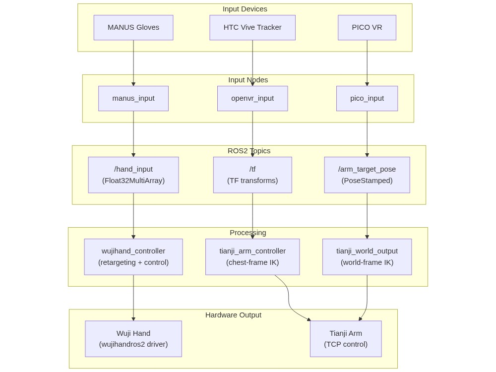
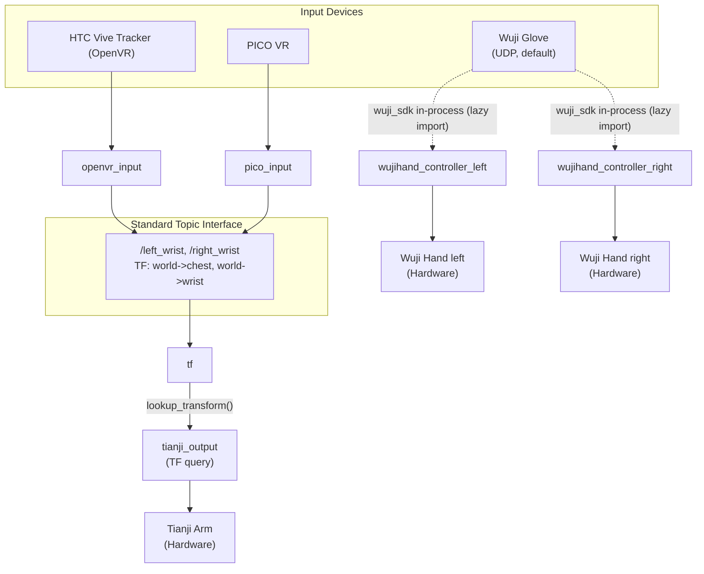

# wuji-hand-teleop

[](LICENSE)  [](https://github.com/wuji-technology/wuji-hand-teleop/releases)

ROS2 teleoperation for **Wuji Hand**, driven by the **[Wuji Glove](https://pypi.org/project/wuji-sdk/)**. This README is the one-page path from a fresh Ubuntu host to **dual hands moving live**, with **one-click launch through the Monitor GUI**. Hand-pose retargeting is the open-source **[wuji-retargeting](https://github.com/wuji-technology/wuji-retargeting)** algorithm; the ROS2 driver is the open-source **[wujihandros2](https://github.com/wuji-technology/wujihandros2)**.

> **Adding arm teleop?** Get the hand pipeline running first, then follow [`docs/STEAMVR.md`](docs/STEAMVR.md) for the HTC Vive Tracker path or [`docs/PICO.md`](docs/PICO.md) for the PICO 4 VR path. Both extend the same image — no rebuild — and the Tianji-arm controllers under `src/output_devices/tianji_output/` (HTC) and `src/output_devices/tianji_world_output/` (PICO) plug in via the topics documented in [Appendix → Custom Input Device](#custom-input-device).

[](docs/teleop-demo.mp4)

Click the image above to download the demo video.

> [!WARNING]
> This project is **not actively maintained** and **no after-sales support** is provided. If you encounter any issues, please [open an issue](https://github.com/wuji-technology/wuji-hand-teleop/issues) — but responses are not guaranteed. **Product version coming soon.**

## Table of Contents

- [Repository Structure](#repository-structure)
- [Quick Start (Docker)](#quick-start-docker) — the only supported deployment, ~10 min from clone to running hands
- [Hardware Configuration](#hardware-configuration) — hand-side setup
- [Running](#running) — Monitor + brake / camera helper UIs
- [Adding arm teleop](#adding-arm-teleop) — pointers to `docs/STEAMVR.md` / `docs/PICO.md`
- [Docker Daily Operations](#docker-daily-operations) — lifecycle, debugging, camera setup
- [System Architecture](#system-architecture)
- [Output](#output)
- [Troubleshooting](#troubleshooting)
- [FAQ](#faq)
- [Citation](#citation)
- [Appendix](#appendix)
  - [Node Reference](#node-reference)
  - [Topic Interface](#topic-interface)
  - [Custom Input Device](#custom-input-device)
  - [Configuration Files Summary](#configuration-files-summary)
  - [Hardware BOM](#hardware-bom)
  - [Documentation Index](#documentation-index)
  - [Acknowledgements](#acknowledgements)
- [Contact](#contact)

## Repository Structure

```text
wuji-hand-teleop/
├── src/
│   ├── wuji_teleop_bringup/       // Launch files for various teleoperation modes
│   │   └── launch/
│   ├── wuji_teleop_monitor/       // Monitor GUI for device monitoring and one-click launch
│   ├── controller/                // Wuji Hand controller (Tianji Arm controller also lives here — see docs/STEAMVR.md / docs/PICO.md)
│   ├── input_devices/             // Input device packages
│   │   ├── wuji_glove/            //   Wuji Glove (default hand input, UDP via wuji-sdk)
│   │   ├── openvr_input/          //   HTC Vive Tracker — arm input, see docs/STEAMVR.md
│   │   ├── pico_input/            //   PICO 4 — arm input, see docs/PICO.md
│   │   │   └── vendor/            //     Vendored XRoboToolkit sources (Apache-2.0 / MIT)
│   │   └── manus_input/           //   MANUS Glove (community-supported, feature-frozen — see package README)
│   ├── output_devices/            // Output device packages
│   │   ├── wujihand_output/       //   Wuji Hand controller with IK
│   │   ├── tianji_output/         //   Tianji Arm controller (HTC / SteamVR path)
│   │   └── tianji_world_output/   //   Tianji Arm controller (PICO / world frame)
│   ├── camera/                    // Cameras: HBVCAM stereo (head) + RealSense D405 (wrists)
│   ├── wujihandros2/              // Wuji Hand ROS2 driver (submodule, ships wuji-description)
│   ├── wuji-retargeting/          // Hand-pose retargeting algorithm (submodule, pip-installed)
│   └── wujihand_urdf/             // URDF models for RViz visualization
├── docker/                        // Docker deployment files
│   └── prebuilt/                  //   PC-Service .deb (Git LFS)
├── docs/                          // Guides, images, and demo videos
├── CHANGELOG.md
└── README.md
```

## Quick Start (Docker)

**Docker is the only supported deployment path.** ROS 2 Humble + every SDK is pre-installed in the image, host source is bind-mounted at `src/`, calibration files mount from `~/.wuji/`. The seven steps below get you from a fresh Ubuntu host to **dual Wuji Hands running via the Monitor GUI**. Arm teleop is layered on top later — see [Adding arm teleop](#adding-arm-teleop).

> **No bare-metal install instructions are maintained.** If you need to install everything natively (unsupported), [`docker/Dockerfile`](docker/Dockerfile) is the canonical recipe — every apt package, pip pin, and SDK version we ship is listed there in build order. You're on your own for version conflicts; the maintainers test only the Docker path.

### Prerequisites (host)

Ubuntu 22.04 LTS, x86_64. The Docker image ships ROS 2, Python deps, vendor SDKs, and retargeting baked in. Only a handful of things need to live on the host:

- **`git` + `git-lfs`** — the prebuilt PC-Service `.deb` and a few SDK `.so` files are LFS-tracked.
  ```bash
  sudo apt install -y git git-lfs
  git lfs install
  ```
- **Docker CE + Compose plugin** — see Step 1 below. Ubuntu's stock `docker.io` does not ship `docker compose`.
- **Wuji Studio 5.18** — required for Wuji Glove (the default hand input). Studio writes calibration to `~/.wuji/sdk/params/<SN>.toml`; `docker-compose.yml` bind-mounts `~/.wuji/` into the container. Download: <https://docs.wuji.tech/docs/en/wuji-studio/latest/>.

Arm teleop is layered on top later (see [Adding arm teleop](#adding-arm-teleop)) — its host-side runtime (SteamVR for HTC Tracker, ADB for PICO) is covered in those per-device guides.

### 1. Install Docker

Stock Ubuntu's `docker.io` package does **not** ship `docker compose`. Pull Docker CE from Docker's official apt repo:

```bash
sudo apt-get update
sudo apt-get install -y ca-certificates curl gnupg

# Add Docker's official GPG key + apt repo
sudo install -m 0755 -d /etc/apt/keyrings
curl -fsSL https://download.docker.com/linux/ubuntu/gpg | \
    sudo gpg --dearmor -o /etc/apt/keyrings/docker.gpg
sudo chmod a+r /etc/apt/keyrings/docker.gpg
echo "deb [arch=$(dpkg --print-architecture) signed-by=/etc/apt/keyrings/docker.gpg] \
    https://download.docker.com/linux/ubuntu $(. /etc/os-release && echo $VERSION_CODENAME) stable" | \
    sudo tee /etc/apt/sources.list.d/docker.list > /dev/null

# Install Docker CE + Compose plugin
sudo apt-get update
sudo apt-get install -y docker-ce docker-ce-cli containerd.io docker-buildx-plugin docker-compose-plugin

# Grant your user permission (re-login or `newgrp docker` to apply)
sudo usermod -aG docker $USER
newgrp docker

# Sanity check
docker --version
docker compose version
```

### 2. Clone the repository

```bash
mkdir -p ~/ros2_ws/src && cd ~/ros2_ws/src
git clone --recurse-submodules https://github.com/wuji-technology/wuji-hand-teleop.git
cd wuji-hand-teleop

# Pull large files (prebuilt PC-Service .deb, vendored SDK binaries, ~280 MB total)
git lfs pull
```

> **Important**: `--recurse-submodules` is required. The repo contains two Wuji-owned submodules — [`wujihandros2`](https://github.com/wuji-technology/wujihandros2) (ROS2 driver; pulls in `external/wuji-description`) and [`wuji-retargeting`](https://github.com/wuji-technology/wuji-retargeting) (hand-pose retargeting algo, pip-installed into the image) — plus the vendored PICO sources under `src/input_devices/pico_input/vendor/`. If you already cloned without it: `git submodule update --init --recursive`.

### 3. Build the image

```bash
cd docker
docker compose build

# In China mainland, point pip at Tsinghua mirror for a faster build:
docker compose build --build-arg PIP_INDEX_URL=https://pypi.tuna.tsinghua.edu.cn/simple
```

The image only contains the runtime environment (ROS 2 + drivers + Python deps + pre-installed SDKs), not the application code. Your host `src/` is bind-mounted into the container, so code changes don't require an image rebuild.

### 4. Calibrate Wuji Gloves

Download [Wuji Studio 5.18](https://docs.wuji.tech/docs/en/wuji-studio/latest/) and run the glove calibration. Studio writes calibration to `~/.wuji/sdk/params/<SN>.toml` on the host; `docker-compose.yml` mounts that directory into the container automatically.

> **Close Wuji Studio before launching teleop.** Studio holds the glove SDK
> connection while it's open, and the gloves accept only one client at a time —
> leaving Studio running makes the teleop glove controller fail to connect
> (`wuji_sdk connect … Connection timeout`, hands never track). Quit Studio once
> calibration is done, then start teleop.

### 5. Configure serial numbers

The repo tracks `<file>.yaml.template` files only. On first container start, `docker/entrypoint.sh` copies each missing `<file>.yaml` from its `.template` sibling so a fresh checkout is one `docker compose up` away from a default-placeholder config. Edit the seeded `<file>.yaml` files with real SNs / IPs; they're gitignored so real values never enter the public repo and `git pull` never conflicts with your edits.

The Monitor GUI's **Scan SNs** button (see §7) automates this for the Wuji Glove and Wuji Hand — it writes directly into the same `<file>.yaml` paths the launch helpers read. Manual editing is documented here as the fallback.

```bash
# a. Wuji Glove SNs — find them via:
python3 -c "from wuji_sdk import SdkManager
for d in SdkManager.instance().scan():
    print(d.sn, d.address, d.transport_type)"

# edit src/input_devices/wuji_glove/config/wuji_glove.yaml:
#   left_glove:  { serial_number: "WG1JA...", device_name: "left_glove" }
#   right_glove: { serial_number: "WG1KA...", device_name: "right_glove" }

# b. Wuji Hand SNs — find them via:
lsusb -v -d 0483:2000 | grep iSerial

# edit src/output_devices/wujihand_output/config/wujihand_ik.yaml:
#   left_hand:  serial_number: "YOUR_LEFT_HAND_SERIAL"
#   right_hand: serial_number: "YOUR_RIGHT_HAND_SERIAL"
#   (input_source defaults to "wuji_glove" — no change needed.)
```

Same template-seeded convention applies to `openvr_input.yaml` (HTC tracker SNs), `pico_input.yaml` (PICO Motion Tracker SNs), and `camera_config.yaml` (D405 wrist serials).

YAML edits land directly on the host filesystem via the `src/` bind-mount and are live thanks to `colcon build --symlink-install`. If you add a brand-new `.template` after the first build, rerun `colcon build --symlink-install` inside the container so the install/share/ symlink picks up the new file.

### 6. Start the container

```bash
# Allow the Monitor GUI (Qt5) to reach the host X server
xhost +local:docker

docker compose up -d
docker logs -f wuji-hand-teleop      # wait for "SDK Status:" to appear
```

First startup automatically runs `colcon build` (~2 min); subsequent startups are ready in seconds. When ready you'll see something like:

```text
SDK Status:
  [OK] WujiHand SDK                        # required for the hand main flow
  [OK] RealSense Driver                    # head + wrist cameras
  [OK] PICO SDK / PC-Service / ADB         # only used when adding PICO arm teleop
  [OK] Tianji SDK                          # only used when adding arm teleop
  [OK] OpenVR (SteamVR null driver)        # only used when adding HTC Tracker arm teleop
```

> The image ships every SDK so the same container can later host arm teleop without a rebuild. For the hand-only main flow only `WujiHand SDK` and the glove SDK (`wuji-sdk`, pip-installed) are exercised; the rest light up `[OK]` because they're installed, not because they're in use.

### 7. Launch teleoperation (Monitor — one-click)

```bash
docker exec -it wuji-hand-teleop bash
ros2 run wuji_teleop_monitor monitor
```

Inside the GUI:
1. Verify the device dashboard — **Wuji Glove** + **Wuji Hand** at the top should both show ● Connected with SNs (otherwise check USB / SDK install).
2. Leave the preset dropdown on `Hand only (Wuji Glove)` — hand-only is the default.
3. Click **Start Teleop** — fingers should follow immediately.
4. Click **Stop Teleop** to safely shut down all nodes when done.

> **Desktop shortcut (optional)** — install a clickable icon on the host desktop so you don't have to `docker exec` first. Run **on the host** (not inside the container):
>
> ```bash
> cd ~/ros2_ws/src/wuji-hand-teleop/src/wuji_teleop_monitor
> ./install_desktop.sh
> ```
>
> The shortcut runs `xhost +local:docker` and `docker exec wuji-hand-teleop ros2 run wuji_teleop_monitor monitor` for you. The wuji-hand-teleop container must already be running (`docker compose up -d`).

**CLI smoke test (optional)** — useful if Monitor doesn't come up:

```bash
ros2 launch wuji_teleop_bringup wuji_teleop_hand.launch.py
# In another terminal:
docker exec -it wuji-hand-teleop bash
ros2 topic hz /left_hand/joint_commands    # target ~120 Hz, sourced from Wuji Glove
ros2 topic hz /right_hand/joint_commands
```

For Docker lifecycle (up/down/stop/start, rebuilds, debugging, camera setup), see [Docker Daily Operations](#docker-daily-operations). To extend to dual-arm teleop, see [Adding arm teleop](#adding-arm-teleop).

## Adding arm teleop

After Quick Start you have dual Wuji Hands moving live, driven by Wuji Gloves and launched from the Monitor GUI. To extend to **dual-arm + hand** teleoperation, follow one of the per-device guides below:

- **HTC Vive Tracker** (recommended) — outside-in 6-DoF via SteamVR base stations and trackers. Full setup: [`docs/STEAMVR.md`](docs/STEAMVR.md).
- **PICO 4 + Motion Trackers** (VR alternative) — headset-based tracking, optional H.264 stereo video back to the headset. Full setup: [`docs/PICO.md`](docs/PICO.md).

The Tianji-arm controllers live under `src/output_devices/tianji_output/` (HTC path) and `src/output_devices/tianji_world_output/` (PICO path); both guides cover their launch flows once the input device is set up. The topic interface for plugging in a custom arm input is in [Appendix → Custom Input Device](#custom-input-device).

Once the arm input device is configured, the `monitor` UI is the recommended entry point: pick `Hand + Arm (HTC Tracker)` or `Hand + Arm (PICO 4)` from the preset dropdown and click **Start Teleop**. The HTC preset runs `wuji_teleop.launch.py enable_arm:=true arm_input:=tracker`; the PICO preset runs `pico_teleop.launch.py enable_robot:=true` (PICO has its own launch file because it uses a different arm controller — see [Appendix → Custom Input Device](#custom-input-device)).

## Hardware Configuration

> **Docker users**: all YAML edits happen on the host filesystem. The container bind-mounts `src/` automatically — no rebuild needed for config changes. Restart the running node (or the container) to pick them up.

Before running teleoperation, set up the serial numbers and configuration for your hardware. All config files are YAML and can be edited with any text editor. All paths below are relative to the `wuji-hand-teleop` directory:

```bash
cd ~/ros2_ws/src/wuji-hand-teleop
```

### 3.1 Wuji Hand Serial Numbers

> **Firmware requirement**: Wuji Hand firmware v1.2.1 or later is recommended. To upgrade firmware, see [wujihand-upgrader](https://github.com/wuji-technology/wujihand-upgrader).

Find your hand serial numbers:

```bash
lsusb -v -d 0483:2000 | grep iSerial
```

Edit `src/output_devices/wujihand_output/config/wujihand_ik.yaml`:

```yaml
left_hand:
  serial_number: "YOUR_LEFT_HAND_SERIAL"    # Replace with your serial, or null to disable
  name: "left_hand"

right_hand:
  serial_number: "YOUR_RIGHT_HAND_SERIAL"   # Replace with your serial, or null to disable
  name: "right_hand"
```

> **Tip**: If you only have one hand, set the other's `serial_number` to `null` to disable it.

### 3.2 Wuji Glove (default hand input)

The hand input source is set by a single line in `src/output_devices/wujihand_output/config/wujihand_ik.yaml`:

```yaml
input_source: "wuji_glove"   # default and only advertised path.
```

**Wuji Glove setup:**

1. **Calibrate with Wuji Studio 5.18** — download from [docs.wuji.tech/docs/en/wuji-studio/latest/](https://docs.wuji.tech/docs/en/wuji-studio/latest/). Studio writes calibration to `~/.wuji/sdk/params/<SN>.toml`; `docker-compose.yml` bind-mounts `~/.wuji/` into the container.
2. **Find your glove serial numbers:**
   ```bash
   python3 -c "from wuji_sdk import SdkManager
   for d in SdkManager.instance().scan():
       print(d.sn, d.address, d.transport_type)"
   ```
3. **Bind serials per side** in `src/input_devices/wuji_glove/config/wuji_glove.yaml`:
   ```yaml
   left_glove:  { serial_number: "WG1JA...", device_name: "left_glove" }
   right_glove: { serial_number: "WG1KA...", device_name: "right_glove" }
   ```

Joint angles are produced by Wuji's open-source retargeting algorithm ([wuji-retargeting](https://github.com/wuji-technology/wuji-retargeting)); per-side parameters live in `src/output_devices/wujihand_output/config/retarget_wuji_glove_{left,right}.yaml`.

### 3.3 Camera System

Default camera layout (see `src/camera/README.md` for full details):

| Position | Default device | Sensor / shutter | Discovery |
|----------|---------------|------------------|-----------|
| Head | **HBVCAM-F2439GS-2 V11** (USB UVC stereo) | AR0234 global shutter | udev symlink `/dev/stereo_camera` (run `bash src/camera/setup_cameras.sh` to install rules) |
| Left wrist | **RealSense D405** | Global shutter | `rs-enumerate-devices \| grep "Serial Number"` |
| Right wrist | **RealSense D405** | Global shutter | `rs-enumerate-devices \| grep "Serial Number"` |

After running `setup_cameras.sh`, edit `src/camera/config/camera_config.yaml` to bind RealSense serials per side:

```yaml
global:
  startup_delay: 5.0
  enable_sync: false

cameras:
  head:
    enabled: true
    type: usb                # USB UVC (HBVCAM)
    video_device: /dev/stereo_camera   # udev symlink, set by setup_cameras.sh

  left_wrist:
    enabled: true
    type: d405
    serial_number: "YOUR_LEFT_WRIST_CAM_SERIAL"
    # ...

  right_wrist:
    enabled: true
    type: d405
    serial_number: "YOUR_RIGHT_WRIST_CAM_SERIAL"
    # ...
```

> The head camera is a stereo USB UVC device, **not** a RealSense — it will not appear in `rs-enumerate-devices`. Use `v4l2-ctl --list-devices` or the `/dev/stereo_camera` symlink instead.

### 3.4 Hand Retargeting (advanced)

All hands use Wuji's open-source [**wuji-retargeting**](https://github.com/wuji-technology/wuji-retargeting) algorithm — MediaPipe-21 keypoints → Wuji Hand joint angles via NLOPT. Per-device parameters live at `src/output_devices/wujihand_output/config/`:

- **Wuji Glove**: `retarget_wuji_glove_{left,right}.yaml`

#### Tunable ROS2 parameters

| Node | Parameter | Default | Notes |
|------|-----------|---------|-------|
| `wujihand_controller` | `control_rate` | 120 Hz | Match hardware refresh |
| `wujihand_controller` | `nlopt_max_eval` | 25 | Override the wuji_retargeting NLOPT cap (library default 50). Lower = faster; raise toward 50 if pinch / extreme-pose accuracy regresses. `0` keeps the library default. |

Arm-side tunables (`tianji_arm_controller`, `tianji_world_output_node`) are documented in [`docs/STEAMVR.md`](docs/STEAMVR.md) and [`docs/PICO.md`](docs/PICO.md) respectively.

Override at launch/startup (parameters are read once at node initialization):

```bash
ros2 run controller wujihand_controller --side left --hand-name left_hand \
  --ros-args -p control_rate:=100.0 -p nlopt_max_eval:=30   # raise for accuracy
```

The control loop pulls the latest input each tick via zero-stamp `lookup_transform`; rates below the input rate drop `(1 - loop_rate/input_rate)` of frames and add up to one period of latency. Match the loop rate to your input device.

## Running

> **Hand input source** is `wujihand_ik.yaml::input_source` and defaults to `"wuji_glove"`. The `manus_input` package ships in the repo for community use but is feature-frozen and not surfaced in the Monitor — see [`src/input_devices/manus_input/README.md`](src/input_devices/manus_input/README.md) if you need it.

### Monitor UIs

The `wuji_teleop_monitor` package ships three console entry points. Pick the one that matches the task.

| Command | When to use |
|---|---|
| `ros2 run wuji_teleop_monitor monitor` | **Default Monitor.** One-click teleop launch (3 hand-first presets), `Scan SNs` discovery + diff-confirm write to `wujihand_ik.yaml` / `wuji_glove.yaml`, live joint preview while teleop is running. The launcher itself doesn't touch the arm SDK. |
| `ros2 run wuji_teleop_monitor brake`   | **Direct-SDK arm recovery.** Pure SDK to the Tianji controller cabinet (default `192.168.1.190`) — no ROS2 services, no controller process required. Release / hold brakes, clear servo errors, read state codes, live joint readout. Use when teleop is OFF. |
| `ros2 run wuji_teleop_monitor camera`  | Four-feed 2×2 preview — stereo head (left/right eye) + dual D405 wrists. Read-only ROS2-topic diagnostic; see [docs/wuji-camera-topics.md](docs/wuji-camera-topics.md). |

> **`brake` and `monitor` must not run teleop concurrently.** Marvin allows a single TCP session — when teleop is up, `tianji_arm_controller` owns it. Stop teleop before connecting `brake`, and disconnect `brake` before re-launching teleop.

#### Monitor workflow (`monitor`)

```bash
source ~/ros2_ws/install/setup.bash
ros2 run wuji_teleop_monitor monitor
```

1. (Optional) Click **Scan SNs** to enumerate Wuji Hand (USB) and Wuji Glove (SDK), then **Save as left** / **Save as right** to write the SN into `wujihand_ik.yaml` / `wuji_glove.yaml`. A unified diff is shown before each write.
2. Pick a preset from the dropdown:
   - `Hand only (Wuji Glove)` — hands only, no arm pipeline (default).
   - `Hand + Arm (HTC Tracker)` — spawns `openvr_input` + `tianji_arm_controller`.
   - `Hand + Arm (PICO 4)` — uses `pico_teleop.launch.py` instead of `openvr_input`.
3. Click **Start Teleop** — the Monitor runs `ros2 launch wuji_teleop_bringup wuji_teleop.launch.py` (hand-only / HTC presets) or `pico_teleop.launch.py` (PICO preset) with the matching flags. Joint angles preview at the bottom once the controllers come up.
4. Click **Stop Teleop** to shut the subprocess down (SIGINT → SIGTERM → SIGKILL escalation).

#### Brake / recovery workflow (`brake`)

```bash
ros2 run wuji_teleop_monitor brake
```

1. Enter the Tianji controller cabinet IP (default `192.168.1.190`) and click **Connect**. The first connect takes ~1–2 s (kinematics + tool-dyn init).
2. Live joint angles stream at 30 Hz. Click **Read Status** to fetch state code + per-servo fault codes.
3. **Release** / **Hold** per arm — releasing pops a confirmation dialog (the arm drops under gravity). **Clear Error** resets servo faults without releasing.
4. Click **Disconnect** before re-launching teleop, or close the window.

### CLI launch (alternative)

```bash
ros2 launch wuji_teleop_bringup wuji_teleop_hand.launch.py
```

This spawns **two independent controller processes** (`wujihand_controller_left` / `wujihand_controller_right`). Each runs its own retargeting + IK on its own GIL — left and right hands no longer share a Python timer or block on each other.

**Verify:**

```bash
# Per-hand retargeted joint commands (target ~120 Hz, matches hand hardware)
ros2 topic hz /left_hand/joint_commands
ros2 topic hz /right_hand/joint_commands
```

> Wuji Glove runs in-process via `wuji_sdk` UDP — no intermediate ROS2 topic. The `/left_hand/joint_commands` / `/right_hand/joint_commands` rates above are what you should verify.

### Launch Parameters

`wuji_teleop.launch.py` accepts the following arguments. CLI defaults keep the legacy hand+arm contract; the `monitor` UI's default preset (`Hand only (Wuji Glove)`) overrides `enable_arm` to `false` so the one-click flow is hand-only unless the operator picks a `Hand + Arm` preset.

| Parameter | Default | Description |
|-----------|---------|-------------|
| `arm_input` | `tracker` | Only `tracker` (HTC Vive via `openvr_input`) is supported here. `pico` is rejected at launch evaluation — use `pico_teleop.launch.py` for the PICO arm path |
| `enable_hand` | `true` | Spawn `wujihand_driver` + `wujihand_controller` (per-side) |
| `enable_arm` | `true` | Spawn `openvr_input` + `tianji_arm_controller`. The Monitor's default preset starts with this OFF |
| `enable_camera` | `true` | Spawn the unified stereo + D405 wrist pipeline |
| `enable_rviz` | `false` | Spawn RViz with the openvr visualization config |
| `hand_config` | default path | Hand configuration file path |
| `left_serial` | from `wujihand_ik.yaml` | Override left hand serial number |
| `right_serial` | from `wujihand_ik.yaml` | Override right hand serial number |

> **Note**: `left_serial` and `right_serial` default to the values in `wujihand_ik.yaml`. You only need to pass them as launch arguments if you want to temporarily override without editing the YAML file. Hand input source has no launch arg — edit `wujihand_ik.yaml::input_source` instead.

## Docker Daily Operations

Lifecycle commands (run from the `docker/` directory):

```bash
cd docker

docker compose up -d                    # Start
docker exec -it wuji-hand-teleop bash        # Enter
docker compose stop                     # Stop (preserves build artifacts)
docker compose start                    # Resume (no rebuild needed)
docker compose down                     # Destroy (next startup re-runs colcon build)
docker compose logs -f                  # Tail container logs
```

Your host `src/` directory is bind-mounted into the container. After modifying code on the host, rebuild inside the container:

```bash
docker exec -it wuji-hand-teleop bash
colcon build --symlink-install
```

> **After a PC reboot**: `cd docker && docker compose up -d`, wait for ready, then enter the container.
>
> **Optional auto-start on boot**: add `restart: unless-stopped` under `services.teleop` in `docker-compose.yml`. Not recommended during rapid development — `docker compose down` will then require a full `colcon build` again.

### Rebuilding the image

Rebuild only when the `Dockerfile` itself or a `prebuilt/` deb changes:

```bash
cd docker
docker compose build              # incremental, uses cache
docker compose build --no-cache   # force full rebuild
```

### Camera setup inside Docker

The Docker image installs the RealSense and stereo drivers, but per-device serial numbers and udev rules still need host-side configuration.

**Head stereo camera** is handled by the `unified_stereo` node (single process, no v4l2loopback required):

```text
Head stereo camera (USB, /dev/stereo_camera) → OpenCV MJPEG 60fps
  ├── ROS 2: split L/R → JPEG → /stereo/{left,right}/compressed (30fps)
  └── PICO: BGR24 → FFmpeg → H.264 → TCP → PICO VR (60fps, on-demand)
```

**Wrist RealSense D405** connects via USB 3.2; left/right are bound by serial number:

```bash
# Verify D405 is connected
lsusb | grep Intel    # expect Intel RealSense

# Check serial numbers
rs-enumerate-devices --compact
#   Intel RealSense D405    <LEFT_SERIAL>     5.15.1.55
#   Intel RealSense D405    <RIGHT_SERIAL>    5.15.1.55

# Launch wrist cameras standalone (inside container)
ros2 launch camera camera_launch.py
```

When replacing a D405, edit `src/camera/config/camera_config.yaml` on the host:

```yaml
cameras:
  left_wrist:
    serial_number: "YOUR_LEFT_WRIST_CAM_SERIAL"    # ← actual serial
  right_wrist:
    serial_number: "YOUR_RIGHT_WRIST_CAM_SERIAL"   # ← actual serial
```

If left/right wrist images come out swapped, swap the two serial numbers.

**udev rules** (on the host) fix camera device paths so they don't drift between reboots:

```bash
sudo cp src/camera/config/udev/99-teleop-cameras.rules /etc/udev/rules.d/
sudo udevadm control --reload-rules && sudo udevadm trigger
```

**ROS 2 topics produced**:

| Topic | Description |
|-------|-------------|
| `/cam_left_wrist/color/image_rect_raw/compressed` | Left wrist D405 |
| `/cam_right_wrist/color/image_rect_raw/compressed` | Right wrist D405 |
| `/stereo/left/compressed` | Head stereo left eye |
| `/stereo/right/compressed` | Head stereo right eye |

> D405 only produces `image_rect_raw` (no `image_raw`).

### GPU acceleration (optional)

NVENC hardware H.264 encoding is auto-detected when an NVIDIA GPU is accessible to the container:

1. Install `nvidia-container-toolkit` on the host
2. Uncomment the `deploy.resources` block in `docker-compose.yml`
3. `docker compose up -d` to recreate the container

Without an NVIDIA GPU, the build falls back to libx264 software encoding automatically (keeps up with 2560×720@60fps on ~1 CPU core).

## System Architecture

> The diagram below shows the **full system** — hand pipeline (the main flow in this README) plus the two arm-input paths covered in [`docs/STEAMVR.md`](docs/STEAMVR.md) (HTC Vive Tracker) and [`docs/PICO.md`](docs/PICO.md) (PICO 4). The hand-only main flow exercises only the `Wuji Glove → wujihand_controller → Wuji Hand` lanes; the arm lanes light up once you add an arm input device.


<details>
<summary>Mermaid source (click to expand)</summary>



**Hand controllers run as two independent processes** (one per side) for multi-core parallelism. Each connects in-process via `wuji_sdk` UDP and subscribes to the hand-skeleton stream — no intermediate ROS2 topic. Each runs its own retarget + IK on its own GIL.

</details>

## Output

After completing Installation and Running, verify the system is working with the following checks:

**Build output (after `colcon build --symlink-install`):**

```text
Summary: 18 packages finished [xx.xs]
  0 packages failed
```

**Launch output (after `ros2 launch wuji_teleop_bringup wuji_teleop_hand.launch.py`):**

```text
[wujihand_controller_left]  ... Initializing left-hand controller (input_source=wuji_glove)...
[wujihand_controller_left]  ... wuji_sdk connected: SN=WG1JA...
[wujihand_controller_left]  ... NLOPT max_eval = 25 (library default: 50)
[wujihand_controller_left]  ... Ready: side=left,  source=wuji_glove, rate=120.0Hz -> /left_hand/joint_commands
[wujihand_controller_right] ... Ready: side=right, source=wuji_glove, rate=120.0Hz -> /right_hand/joint_commands
```

**Topic verification (in a new terminal):**

```bash
# Per-hand retargeted joint commands (target ~120 Hz, matches hardware refresh)
ros2 topic hz /left_hand/joint_commands
ros2 topic hz /right_hand/joint_commands
```

If the verifications above do not show the expected values, see [Troubleshooting](#troubleshooting).

## Troubleshooting

| Problem | Solution |
|---------|----------|
| Hand serial not found | Run `lsusb -v -d 0483:2000 \| grep iSerial` |
| Robot connection failed | Verify robot is powered on, confirm IP address with `ping`, check network |
| TF tree incomplete | Ensure `tf_broadcaster` node is running |
| `ImportError: wuji_retargeting` | The `wuji-retargeting` submodule wasn't initialised before the image was built. On the host: `git submodule update --init --recursive src/wuji-retargeting`, then `docker compose build` (the Dockerfile §6 COPYs the submodule source into the image). |
| `wujihandcpp not found` | Install C++ SDK: `wget https://github.com/wuji-technology/wujihandpy/releases/download/v1.5.1/wujihandcpp-1.5.1-amd64.deb && sudo apt install ./wujihandcpp-1.5.1-amd64.deb` |
| Package not found | Run `colcon build` then `source install/setup.bash` |
| Any SteamVR / HTC Vive Tracker problem (tracker not recognized, flickering, "No HMD", null-driver inactive) | See [docs/STEAMVR.md §8 FAQ](docs/STEAMVR.md#8-faq) |
| Any PICO problem (initialization timeout, H.264 no image, ADB forward, `TCP connect failed`) | See [docs/PICO.md §7 FAQ](docs/PICO.md#7-faq) |
| Camera not recognized | Check USB connection, run `lsusb` or `v4l2-ctl --list-devices` |
| RealSense launch failure | Verify librealsense installation, test with `realsense-viewer` |
| StereoVR no image | Check v4l2loopback module: `lsmod \| grep v4l2loopback` |
| Forgot `--recurse-submodules` | Run `git submodule update --init --recursive` |
| MANUS Glove (community-supported, feature-frozen) | See [`src/input_devices/manus_input/README.md`](src/input_devices/manus_input/README.md) |

**Enable debug logging:**

```bash
# Single node
ros2 run controller wujihand_controller --ros-args --log-level debug

# Dynamically adjust in another terminal
ros2 service call /wujihand_controller/set_logger_level rcl_interfaces/srv/SetLoggerLevel \
  "{logger_name: 'wujihand_controller', level: 10}"
# level: 10=DEBUG, 20=INFO, 30=WARN, 40=ERROR
```

## FAQ

| Problem | Solution |
|---------|----------|
| `docker compose` not found | Stock Ubuntu's `docker.io` does not ship the Compose plugin. Follow [Quick Start §1 Install Docker](#1-install-docker) to add Docker's official apt repo. |
| `permission denied` on Docker | `sudo usermod -aG docker $USER && newgrp docker` |
| `wujihand_controller` crashes at launch with `ModuleNotFoundError` / URDF fails to load | Submodules out of date. On the host: `git submodule update --init --recursive` (in particular `src/wujihandros2`, which pulls in `external/wuji-description`), then re-run `colcon build --symlink-install` inside the container. |
| Need to rebuild colcon after `docker compose down` | Use `stop`/`start` instead of `down`/`up` to preserve `install/`. |
| Monitor GUI cannot display | Run `xhost +local:docker` on the host to allow X11 access. |
| D405 wrist camera not recognized | Confirm a USB 3.2 port and check `lsusb \| grep Intel`. |
| NVENC encoding failure | Falls back to libx264 automatically when no GPU is available. See [GPU acceleration](#gpu-acceleration-optional) to enable NVENC. |
| `import pinocchio` fails with `liburdfdom_sensor.so.4.0: cannot open` | The `pin` wheel pinned in the Dockerfile is older than 4.0.0. Update to `pin==4.0.0` (which bundles a working urdfdom) — the current Dockerfile already pins this version. |

## Citation

If you find this project useful, please consider citing it:

```bibtex
@software{wuji2025handteleop,
  title   = {Wuji Hand Teleop: ROS2 Teleoperation for Dexterous Hands and Robot Arms},
  author  = {Guanqi He, Wentao Zhang, Liang Zhu, Duo Han, and Shiquan Qiu},
  year    = {2026},
  url     = {https://github.com/wuji-technology/wuji-hand-teleop}
}
```

## Appendix

### Node Reference

| Node | Package | Description |
|------|---------|-------------|
| `openvr_input` | openvr_input | HTC Vive Tracker data collection |
| `pico_input` | pico_input | PICO VR hand and wrist tracking |
| `wujihand_controller` | controller | Wuji Hand control node (one process per hand) |
| `tianji_arm_controller` | controller | Tianji Arm control node |

### Topic Interface

| Topic | Type | Publisher | Description |
|-------|------|-----------|-------------|
| `/left_hand/joint_commands` | `sensor_msgs/JointState` | wujihand_controller_left | Retargeted left-hand joint targets (~120 Hz) |
| `/right_hand/joint_commands` | `sensor_msgs/JointState` | wujihand_controller_right | Retargeted right-hand joint targets (~120 Hz) |
| `/tf` | `TFMessage` | tf_broadcaster | TF transforms |

> For a complete list of all active topics, run `ros2 topic list` after launch.

### Custom Input Device

**Hand control** — the supported integration path is to write a thin Python publisher that talks to your hardware and feeds joint targets straight to the hands. `src/output_devices/wujihand_output/wujihand_controller.py` is the reference: it dispatches on `wujihand_ik.yaml::input_source`, runs retargeting in-process, and publishes `/left_hand/joint_commands` + `/right_hand/joint_commands` (`sensor_msgs/JointState`). To plug in custom hand input, either (a) add a new `input_source` branch that owns its own SDK loop, or (b) publish `JointState` directly to the topics above and bypass the controller. The community-supported MANUS package under `src/input_devices/manus_input/` is a working reference for the per-topic bridge pattern.

**Arm control** — two options depending on which output package you use:

- **TF mode** (for `tianji_output` / SteamVR): publish TF transforms to `left_wrist` / `right_wrist` / `chest` frames
- **Topic mode** (for `tianji_world_output` / PICO): publish `PoseStamped` to `/left_arm_target_pose` (frame: `world_left`) and `/right_arm_target_pose` (frame: `world_right`). These are chest-frame poses — `pico_input` converts from world coordinates internally. If building a custom input, you need to transform your world-frame pose into the `world_left`/`world_right` chest frame before publishing. See `tianji_world_output/transform_utils.py` for coordinate transform utilities.

### Configuration Files Summary

| Config | File Path |
|--------|-----------|
| Wuji Hand serials | `src/output_devices/wujihand_output/config/wujihand_ik.yaml` |
| Wuji Glove serials | `src/input_devices/wuji_glove/config/wuji_glove.yaml` |
| Hand retargeting | `src/output_devices/wujihand_output/config/retarget_wuji_glove_{left,right}.yaml` |
| HTC Tracker serials | `src/input_devices/openvr_input/config/openvr_input.yaml` |
| Camera serials | `src/camera/config/camera_config.yaml` |
| Tianji Arm IP | `src/output_devices/tianji_output/tianji_output/config/tianji_output.yaml` |

### Hardware BOM

For a complete list of hardware components, see the **[Hardware Bill of Materials](https://docs.google.com/document/d/19Md8R5tw9OyTvOUD-JKt7S6xMivlHVSCSNAKuoZr1eo/edit?tab=t.0)**.

### Documentation Index

**User-facing setup guides** (`docs/`) — read before first use:

| Document | When to read |
|---|---|
| [docs/STEAMVR.md](docs/STEAMVR.md) | Setting up the HTC Vive Tracker arm path: SteamVR null driver, base-station placement, dongle pairing, tracker serial scan |
| [docs/PICO.md](docs/PICO.md) | Setting up the PICO 4 arm path: Developer Mode, XRoboToolkit APK, ADB reverse-forwarding, H.264 stereo streaming |
| [docs/tracker-wearing-guide.md](docs/tracker-wearing-guide.md) | Physical tracker placement on the body |

**Per-package references** — read when working in that area:

| Document | When to read |
|---|---|
| [src/input_devices/pico_input/README.md](src/input_devices/pico_input/README.md) | PICO input ROS2 node — config, topics, troubleshooting |
| [src/input_devices/pico_input/ARCHITECTURE.md](src/input_devices/pico_input/ARCHITECTURE.md) | PICO coordinate transforms + incremental-control derivation (read this for coordinate-frame bugs) |
| [src/input_devices/manus_input/README.md](src/input_devices/manus_input/README.md) | MANUS Glove (community-supported, feature-frozen) — setup, calibration, troubleshooting |
| [src/output_devices/tianji_world_output/README.md](src/output_devices/tianji_world_output/README.md) | Tianji arm controller (world-frame, incremental control) |
| [src/camera/README.md](src/camera/README.md) | Camera configuration and setup |
| [Hardware BOM](https://docs.google.com/document/d/19Md8R5tw9OyTvOUD-JKt7S6xMivlHVSCSNAKuoZr1eo/edit?tab=t.0) | Complete hardware bill of materials |

### Acknowledgements

- **StereoVR stereo vision module** — Liang ZHU (lzhu686@connect.hkust-gz.edu.cn)
- **Tianji Arm controller** — based on [TJ_FX_ROBOT_CONTRL_SDK](https://github.com/cynthia-you/TJ_FX_ROBOT_CONTRL_SDK)
- **Related projects**:
  - [wuji-retargeting](https://github.com/wuji-technology/wuji-retargeting) — Hand pose retargeting algorithm
  - [wujihandros2](https://github.com/wuji-technology/wujihandros2) — Wuji Hand ROS2 driver

### Third-Party Code

Source code under `src/input_devices/pico_input/vendor/` is vendored from upstream projects; each subdirectory keeps its original `LICENSE` (and `THIRD_PARTY_NOTICE.txt` where applicable). **Copyright of third-party libraries in `vendor/` goes to their respective authors.**

| Project | Upstream | License |
|---|---|---|
| `src/input_devices/pico_input/vendor/XRoboToolkit-PC-Service` | <https://github.com/XR-Robotics/XRoboToolkit-PC-Service> | Apache-2.0 |
| `src/input_devices/pico_input/vendor/XRoboToolkit-PC-Service-Pybind` | <https://github.com/XR-Robotics/XRoboToolkit-PC-Service-Pybind> | MIT |

The repository [`LICENSE`](LICENSE) (MIT, see badge at the top) applies only to files outside `vendor/`.

## Contact

For any questions, please contact [support@wuji.tech](mailto:support@wuji.tech).
