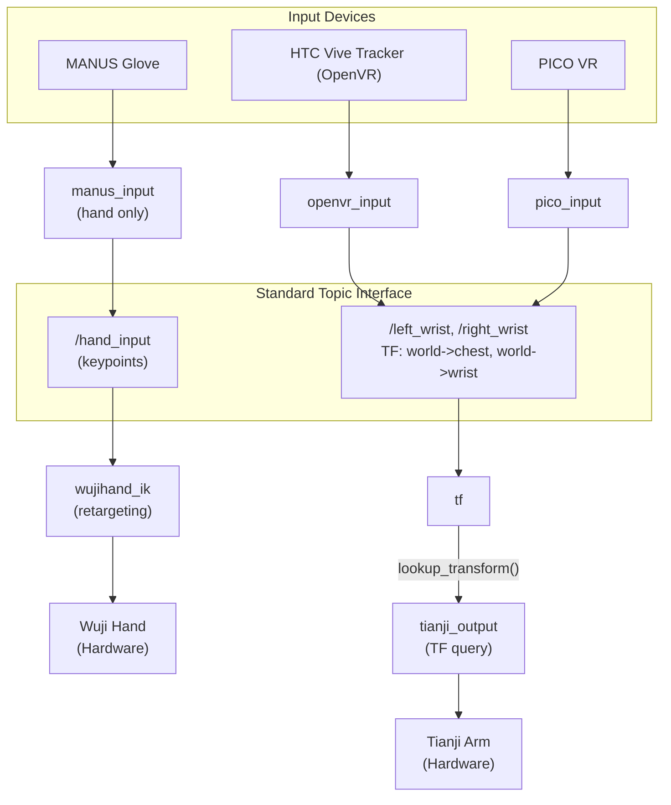

# wuji-hand-teleop

[](LICENSE)  [](https://github.com/wuji-technology/wuji-hand-teleop/releases)

ROS2-based teleoperation system for Wuji Hand and Tianji Arm. Supports multiple input devices including MANUS Gloves, HTC Vive Trackers, PICO VR, and custom devices through a standardized topic interface. Features a Monitor GUI for one-click launch and real-time device monitoring.

> [!WARNING]
> This project is **not actively maintained** and **no after-sales support** is provided. If you encounter any issues, please [open an issue](https://github.com/wuji-technology/wuji-hand-teleop/issues) — but responses are not guaranteed. **Product version coming soon.**

## Table of Contents

- [Hardware BOM](#hardware-bom)
- [Repository Structure](#repository-structure)
- [Usage](#usage)
  - [Prerequisites](#prerequisites)
  - [Installation](#installation)
  - [Running](#running)
  - [Monitor GUI](#monitor-gui)
  - [Input Device Setup](#input-device-setup)
  - [Configuration Reference](#configuration-reference)
  - [Node Reference](#node-reference)
  - [Topic Interface](#topic-interface)
  - [Custom Input Device](#custom-input-device)
- [Troubleshooting](#troubleshooting)
- [Acknowledgements](#acknowledgements)
- [Citation](#citation)
- [Contact](#contact)

## Hardware BOM

For a complete list of hardware components required to build this teleoperation system, see the **[Hardware Bill of Materials](https://docs.google.com/document/d/19Md8R5tw9OyTvOUD-JKt7S6xMivlHVSCSNAKuoZr1eo/edit?tab=t.0)**.

## Repository Structure

```text
wuji-hand-teleop/
├── src/
│   ├── wuji_teleop_bringup/       # Launch files for various teleoperation modes
│   │   └── launch/
│   ├── wuji_teleop_monitor/       # Monitor GUI for device monitoring and one-click launch
│   │   └── wuji_teleop_monitor/
│   ├── controller/                # Controller nodes for Wuji Hand and Tianji Arm
│   │   └── controller/
│   ├── input_devices/             # Input device packages
│   │   ├── openvr_input/          #   HTC Vive Tracker
│   │   ├── manus_input/           #   MANUS Glove
│   │   └── pico_input/            #   PICO VR
│   ├── output_devices/            # Output device packages
│   │   ├── tianji_output/         #   Tianji Arm controller
│   │   └── wujihand_output/       #   Wuji Hand controller with IK
│   ├── camera/                    # Camera system (RealSense, USB, StereoVR)
│   │   ├── camera/
│   │   └── stereocamera/
│   └── wujihand_urdf/            # URDF models for RViz visualization
└── README.md
```

## Usage

### Prerequisites

- Ubuntu 22.04 LTS
- ROS2 Humble
- Python 3.10+

**Supported devices:**

| Category | Device | Description |
|----------|--------|-------------|
| Hand input | MANUS Glove | Data glove |
| Hand input | PICO 4 + Tracker | VR headset + hand tracker |
| Hand input | Custom device | Publish to `/hand_input` topic |
| Arm input | HTC Vive Tracker | External tracker |
| Arm input | Custom device | Publish TF to `left_wrist`/`right_wrist` |

### Installation

1. **Install ROS2 dependencies**

   ```bash
   sudo apt install ros-humble-desktop
   sudo apt install ros-humble-ament-cmake ros-humble-rclpy ros-humble-std-msgs ros-humble-tf2-ros
   pip install numpy scipy pyyaml PyQt5 openvr
   ```

2. **Install external dependencies**

   ```bash
   # wujihandcpp C++ SDK (required by wujihand_driver)
   # Pre-installed in Docker; for bare metal see: src/wujihandros2/README.md

   # Hand retargeting algorithm
   cd ~/ros2_ws/src
   git clone --recurse-submodules https://github.com/wuji-technology/wuji-retargeting.git
   cd wuji-retargeting && pip install -e .
   ```

   > **Note**: `--recurse-submodules` is required because the repo contains git submodules.

3. **Build**

   ```bash
   cd ~/ros2_ws
   colcon build --symlink-install
   source install/setup.bash
   ```

### Running

#### Full teleoperation (hand + arm)

```bash
# Manus hand + Tracker arm (default)
ros2 launch wuji_teleop_bringup wuji_teleop.launch.py hand_input:=manus arm_input:=tracker

# With RViz visualization
ros2 launch wuji_teleop_bringup wuji_teleop.launch.py hand_input:=manus arm_input:=tracker enable_rviz:=true
```

#### Single-side teleoperation (one hand + one arm)

```bash
# Right side: Manus + Tracker
ros2 launch wuji_teleop_bringup wuji_teleop_single.launch.py side:=right hand_input:=manus arm_input:=tracker

# Left side: Manus + Tracker
ros2 launch wuji_teleop_bringup wuji_teleop_single.launch.py side:=left hand_input:=manus arm_input:=tracker
```

#### Hand-only control

```bash
ros2 launch wuji_teleop_bringup wuji_teleop_hand.launch.py hand_input:=manus
```

#### Arm-only control

```bash
ros2 launch wuji_teleop_bringup wuji_teleop_arm.launch.py arm_input:=tracker
```

#### Debug arm axis

Verify upper-arm tracker Y-axis direction and `zsp_para` without connecting the robot:

```bash
ros2 launch wuji_teleop_bringup debug_arm_axis.launch.py
```

#### Launch parameters

| Parameter | Default | Description |
|-----------|---------|-------------|
| `hand_input` | `manus` | Hand input source: `manus` (MANUS Gloves) |
| `arm_input` | `tracker` | Arm input source: `tracker` (HTC Vive Trackers) |
| `side` | `right` | Single-side mode: `left` or `right` |
| `enable_rviz` | `false` | Enable RViz visualization |
| `hand_config` | default path | Hand configuration file path |

### Monitor GUI

Monitor is the recommended way to operate the teleoperation system. It provides device monitoring and one-click launch.

```bash
source ~/ros2_ws/install/setup.bash
ros2 run wuji_teleop_monitor monitor
```

**Available launch presets** (all use Manus + Tracker):

| Preset | Description | Launch file |
|--------|-------------|-------------|
| Hand only (Manus+Wuji) | Glove to dexterous hand | `wuji_teleop_hand.launch.py` |
| Arm only (Tracker+Tianji) | Tracker to Tianji Arm | `wuji_teleop_arm.launch.py` |
| Hand+Arm full | Full teleoperation | `wuji_teleop.launch.py` |
| Hand+Arm+Camera full | With camera system | `wuji_teleop_camera.launch.py` |
| Hand+Arm single (left) | Left side only | `wuji_teleop_single.launch.py` |
| Hand+Arm single (right) | Right side only | `wuji_teleop_single.launch.py` |

**Workflow:**

1. Launch Monitor
2. Verify device connections (gloves, hands, arms, trackers)
3. Select a launch preset from the dropdown
4. Click "Start Teleoperation"
5. Click "Stop" to safely shut down all nodes

> **Warning**: After releasing the arm brake, the arm may drop due to gravity. Ensure safety before operating.

### Input Device Setup

#### MANUS Glove

The project includes a built-in MANUS C++ SDK at `manus_ros2/ManusSDK/`.

**Calibration (required per user):**

1. Download Manus Core software on a Windows PC
2. Connect and calibrate both hands following the software prompts
3. Export calibration files (`.mcal` format) for left and right hands separately
4. Copy files to the calibration directory:

   ```bash
   cd src/input_devices/manus_input/manus_ros2/calibration/
   cp /path/to/left_calibration.mcal LeftMetaglovePro.mcal
   cp /path/to/right_calibration.mcal RightMetaglovePro.mcal
   ```

5. Rebuild: `colcon build --packages-select manus_ros2 && source install/setup.bash`

**Run the MANUS node:**

```bash
ros2 run manus_ros2 manus_driver
# or
ros2 launch manus_ros2 manus_driver.launch.py
```

**Published topics:**

| Topic | Type | Frequency | Description |
|-------|------|-----------|-------------|
| `/manus/left_hand/skeleton` | `geometry_msgs/PoseArray` | 200 Hz | Left hand skeleton poses |
| `/manus/right_hand/skeleton` | `geometry_msgs/PoseArray` | 200 Hz | Right hand skeleton poses |
| `/manus/left_hand/joint_states` | `sensor_msgs/JointState` | 200 Hz | Left hand joint angles |
| `/manus/right_hand/joint_states` | `sensor_msgs/JointState` | 200 Hz | Right hand joint angles |

**Glove configuration** at `src/input_devices/manus_input/manus_input_py/manus_input_py/config/manus_input.yaml`:

```yaml
include_right_hand: true
include_left_hand: true
left_glove_id: 0
right_glove_id: 1
```

#### HTC Vive Tracker

**Hardware setup:**

1. Plug in two Tracker USB dongles
2. Place two base stations in front of and behind the robot, level and unobstructed
3. Set base stations to different channels (A/B/C) to avoid interference

**SteamVR headless mode** (required for tracker-only use without a VR headset):

1. Install Steam and SteamVR: `sudo apt install steam`
2. Modify SteamVR `default.vrsettings`:
   - `"requireHmd": false`
   - `"forcedDriver": "null"`
   - `"activateMultipleDrivers": true`

**Get tracker serial numbers** (SteamVR must be running):

```bash
python3 -c "
import openvr
openvr.init(openvr.VRApplication_Other)
vr = openvr.VRSystem()
for i in range(64):
    if vr.getTrackedDeviceClass(i) == openvr.TrackedDeviceClass_GenericTracker:
        serial = vr.getStringTrackedDeviceProperty(i, openvr.Prop_SerialNumber_String)
        connected = vr.isTrackedDeviceConnected(i)
        status = 'Online' if connected else 'Offline'
        print(f'Tracker: {serial} [{status}]')
openvr.shutdown()
"
```

**Configure tracker mapping** at `src/input_devices/openvr_input/config/openvr_input.yaml`:

```yaml
tracker_serials:
  chest: "LHR-XXXXXXXX"        # Chest tracker
  right_wrist: "LHR-XXXXXXXX"  # Right wrist tracker
  left_wrist: "LHR-XXXXXXXX"   # Left wrist tracker
  right_arm: "LHR-XXXXXXXX"    # Right upper-arm tracker (for arm angle following)
  left_arm: "LHR-XXXXXXXX"     # Left upper-arm tracker (optional)
```

**Tracker placement:**

| Tracker | Position | Purpose |
|---------|----------|---------|
| `chest` | Center of chest | Body coordinate origin |
| `left_wrist` | Left wrist | Left arm end position |
| `right_wrist` | Right wrist | Right arm end position |
| `left_arm` | Left upper arm | Left arm angle following (optional) |
| `right_arm` | Right upper arm | Right arm angle following (optional) |

#### Camera system

Edit `src/camera/config/camera_config.yaml`:

```yaml
global:
  startup_delay: 2.0
  enable_sync: true

cameras:
  head:
    enabled: true
    type: d435i              # d435i, d405, or usb
    camera_name: head_camera
    serial_number: ""        # Leave empty for auto-detection
    resolution:
      width: 640
      height: 480
      fps: 30
    streams:
      enable_color: true
      enable_depth: false

  left_wrist:
    enabled: true
    type: d405
    # ...

  right_wrist:
    enabled: true
    type: d405
    # ...
```

```bash
# Launch cameras
ros2 launch camera camera_launch.py

# Launch StereoVR
ros2 launch camera stereovr_launch.py

# Get RealSense serial numbers
rs-enumerate-devices | grep "Serial Number"
```

### Configuration Reference

#### Wuji Hand

Edit `src/output_devices/wujihand_output/config/wujihand_ik.yaml`:

```yaml
right_hand_serial: "337A386F3233"   # Set to null to disable
left_hand_serial: "337438793233"
use_joint_input: false
```

Get serial numbers: `lsusb -v -d 0483:2000 | grep iSerial`

#### Hand retargeting

Config files at `src/output_devices/wujihand_output/config/`:

| Input source | Config file | Note |
|--------------|-------------|------|
| Manus (right) | `retarget_manus_right.yaml` | z rotation: -15 degrees |
| Manus (left) | `retarget_manus_left.yaml` | z rotation: +15 degrees |

Key parameters:

```yaml
retarget:
  mediapipe_rotation:
    x: 0.0
    y: 0.0
    z: -15.0             # Manus right: -15, left: +15

  segment_scaling:       # Finger segment length scaling
    thumb:  [0.98, 0.95, 0.95]
    index:  [0.9, 0.95, 0.98]

  lp_alpha: 0.2          # Low-pass filter coefficient (smaller = smoother)
```

> **Note**: Manus left and right hands use separate config files due to coordinate system differences. When modifying retarget parameters, update both files (all parameters are identical except `mediapipe_rotation.z`).

#### Tianji Arm

Edit `src/output_devices/tianji_output/tianji_output/config/tianji_output.yaml`:

```yaml
robot_ip: "192.168.1.190"
```

### Node Reference

| Node | Package | Description |
|------|---------|-------------|
| `manus_data_publisher` | manus_ros2 | MANUS Glove C++ driver, publishes raw data |
| `manus_input` | manus_input_py | MANUS data processor, converts to MediaPipe format |
| `openvr_input` | openvr_input | HTC Vive Tracker data collection |
| `pico_input` | pico_input | PICO VR hand and wrist tracking |
| `wujihand_controller` | controller | Wuji Hand control node |
| `tianji_arm_controller` | controller | Tianji Arm control node |

### Topic Interface

#### Published topics

| Topic | Type | Publisher | Description |
|-------|------|-----------|-------------|
| `/hand_input` | `Float32MultiArray` | manus_input, pico_input | MediaPipe hand keypoints (63 values per hand, 126 = 2 x 21 x 3 for both) |
| `/manus_glove_0` | `ManusGlove` | manus_data_publisher | Left hand MANUS raw data |
| `/manus_glove_1` | `ManusGlove` | manus_data_publisher | Right hand MANUS raw data |
| `/tf` | `TFMessage` | tf_broadcaster | TF transforms |

### Custom Input Device

Publish to the following interface to integrate a custom input device:

**Hand control** — publish to `/hand_input` (`std_msgs/Float32MultiArray`):

- Single hand: 63 values (21 keypoints x 3 coordinates)
- Dual hands: 126 values (right hand first, then left)

**Keypoint order (21 points per hand, MediaPipe format):**

```text
0: WRIST
1-4: THUMB (CMC, MCP, IP, TIP)
5-8: INDEX (MCP, PIP, DIP, TIP)
9-12: MIDDLE (MCP, PIP, DIP, TIP)
13-16: RING (MCP, PIP, DIP, TIP)
17-20: PINKY (MCP, PIP, DIP, TIP)
```

**Arm control** — publish TF transforms to `left_wrist` / `right_wrist` / `chest` frames.

## System Architecture



## Troubleshooting

| Problem | Solution |
|---------|----------|
| Hand serial not found | Run `lsusb -v -d 0483:2000 \| grep iSerial` |
| Robot connection failed | Verify robot is powered on, confirm IP address with `ping`, check network |
| TF tree incomplete | Ensure `tf_broadcaster` node is running |
| `ImportError: wuji_retargeting` | Install from source: `pip install -e .` |
| `wujihandcpp not found` | Install C++ SDK: `sudo apt install ./wujihandcpp-*.deb` (see wujihandros2/README.md) |
| Package not found | Run `colcon build` then `source install/setup.bash` |
| Tracker flickering / lost tracking | Check base station placement and angles |
| SteamVR "No HMD" error | Verify headless mode configuration |
| Tracker not recognized | Confirm dongle is plugged in, tracker is powered on and paired |
| Camera not recognized | Check USB connection, run `lsusb` or `v4l2-ctl --list-devices` |
| RealSense launch failure | Verify librealsense installation, test with `realsense-viewer` |
| StereoVR no image | Check v4l2loopback module: `lsmod \| grep v4l2loopback` |
| Calibration drift after applying | Verify correct `.mcal` file for each hand, rebuild and re-source |

**Enable debug logging:**

```bash
# Single node
ros2 run controller wujihand_controller --ros-args --log-level debug

# Dynamically adjust in another terminal
ros2 service call /wujihand_controller/set_logger_level rcl_interfaces/srv/SetLoggerLevel \
  "{logger_name: 'wujihand_controller', level: 10}"
# level: 10=DEBUG, 20=INFO, 30=WARN, 40=ERROR
```

## Acknowledgements

- **StereoVR stereo vision module** — Liang ZHU (lzhu686@connect.hkust-gz.edu.cn)
- **Tianji Arm controller** — based on [TJ_FX_ROBOT_CONTRL_SDK](https://github.com/cynthia-you/TJ_FX_ROBOT_CONTRL_SDK)
- **Related projects**:
  - [wuji-retargeting](https://github.com/wuji-technology/wuji-retargeting) — Hand pose retargeting algorithm
  - [wujihandros2](https://github.com/wuji-technology/wujihandros2) — Wuji Hand ROS2 driver
  - [pico-ros2-bridge](https://github.com/wuji-technology/pico-ros2-bridge) — PICO VR to ROS2 bridge

## Citation

If you find this project useful, please consider citing it:

```bibtex
@software{wuji2025handteleop,
  title   = {Wuji Hand Teleop: ROS2 Teleoperation for Dexterous Hands and Robot Arms},
  author  = {Guanqi He and Wentao Zhang and Liang Zhu},
  year    = {2025},
  url     = {https://github.com/wuji-technology/wuji-hand-teleop}
}
```

## Contact

For bug reports and feature requests, please [open an issue](https://github.com/wuji-technology/wuji-hand-teleop/issues).
